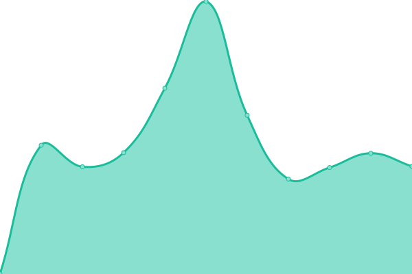

# [📈 Live Status](https://status.the-bwc.com): <!--live status--> **🟩 All systems operational**

This repository contains the open-source uptime monitor and status page for [Black Widow Company](https://the-bwc.com), powered by [Upptime](https://github.com/upptime/upptime).

With [Upptime](https://upptime.js.org), you can get your own unlimited and free uptime monitor and status page, powered entirely by a GitHub repository. We use [Issues](https://github.com/the-bwc/uptime-monitor/issues) as incident reports, [Actions](https://github.com/the-bwc/uptime-monitor/actions) as uptime monitors, and [Pages](https://the-bwc.github.io/uptime-monitor) for the status page.

<!--start: status pages-->
<!-- This summary is generated by Upptime (https://github.com/upptime/upptime) -->
<!-- Do not edit this manually, your changes will be overwritten -->
<!-- prettier-ignore -->
| URL | Status | History | Response Time | Uptime |
| --- | ------ | ------- | ------------- | ------ |
|  [widowmakers.org](https://widowmakers.org) | 🟩 Up | [widowmakers-org.yml](https://github.com/THE-BWC/uptime-monitor/commits/HEAD/history/widowmakers-org.yml) | 

 813ms
     
 | 

<a href="https://status.widowmakers.org/history/widowmakers-org">100.00%</a>
    

|  [vb5.widowmakers.org](https://vb5.widowmakers.org/forum/index.php) | 🟩 Up | [vb5-widowmakers-org.yml](https://github.com/THE-BWC/uptime-monitor/commits/HEAD/history/vb5-widowmakers-org.yml) | 

 916ms
     
 | 

<a href="https://status.widowmakers.org/history/vb5-widowmakers-org">100.00%</a>
    

|  [discord.widowmakers.org](https://discord.widowmakers.org) | 🟩 Up | [discord-widowmakers-org.yml](https://github.com/THE-BWC/uptime-monitor/commits/HEAD/history/discord-widowmakers-org.yml) | 

 965ms
     
 | 

<a href="https://status.widowmakers.org/history/discord-widowmakers-org">100.00%</a>
    

|  [widowmakers.org - IPv6](https://widowmakers.org) | 🟩 Up | [widowmakers-org-i-pv6.yml](https://github.com/THE-BWC/uptime-monitor/commits/HEAD/history/widowmakers-org-i-pv6.yml) | 

 606ms
     
 | 

<a href="https://status.widowmakers.org/history/widowmakers-org-i-pv6">100.00%</a>
    

|  [vb5.widowmakers.org - IPv6](https://vb5.widowmakers.org/forum/index.php) | 🟩 Up | [vb5-widowmakers-org-i-pv6.yml](https://github.com/THE-BWC/uptime-monitor/commits/HEAD/history/vb5-widowmakers-org-i-pv6.yml) | 

 584ms
     
 | 

<a href="https://status.widowmakers.org/history/vb5-widowmakers-org-i-pv6">100.00%</a>
    

|  [discord.widowmakers.org - IPv6](https://discord.widowmakers.org) | 🟩 Up | [discord-widowmakers-org-i-pv6.yml](https://github.com/THE-BWC/uptime-monitor/commits/HEAD/history/discord-widowmakers-org-i-pv6.yml) | 

 656ms
     
 | 

<a href="https://status.widowmakers.org/history/discord-widowmakers-org-i-pv6">100.00%</a>
    

<!--end: status pages-->

[**Visit our status website →**](https://status.the-bwc.com)

## 📄 License

- Powered by: [Upptime](https://github.com/upptime/upptime)
- Code: [MIT](./LICENSE) © [Anand Chowdhary](https://anandchowdhary.com), supported by [Pabio](https://pabio.com)
- Data in the `./history` directory: [Open Database License](https://opendatacommons.org/licenses/odbl/1-0/)
